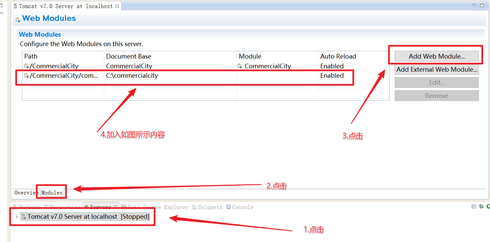
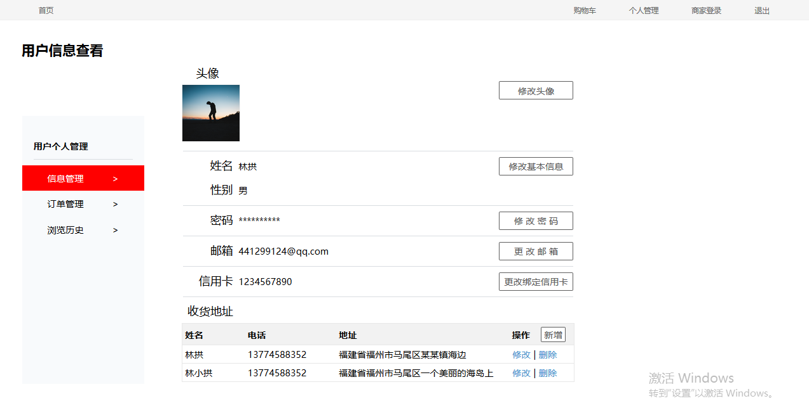
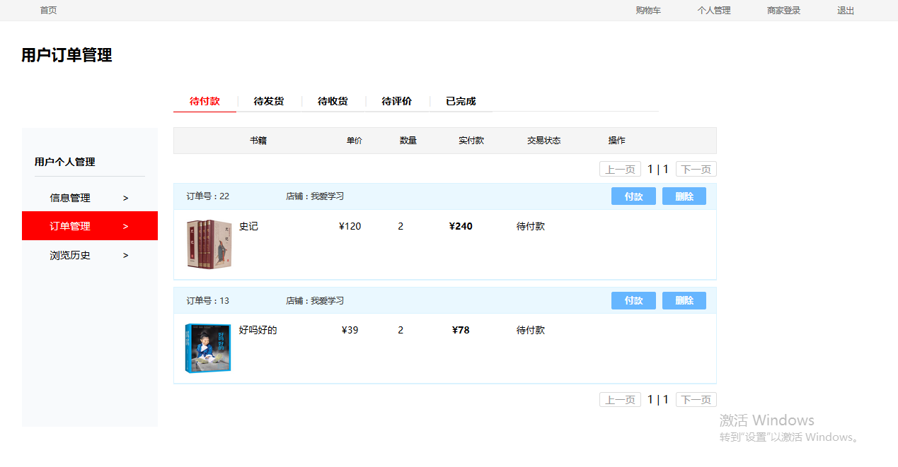
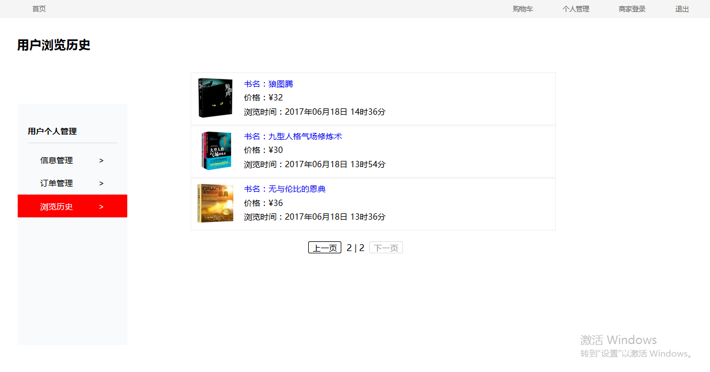
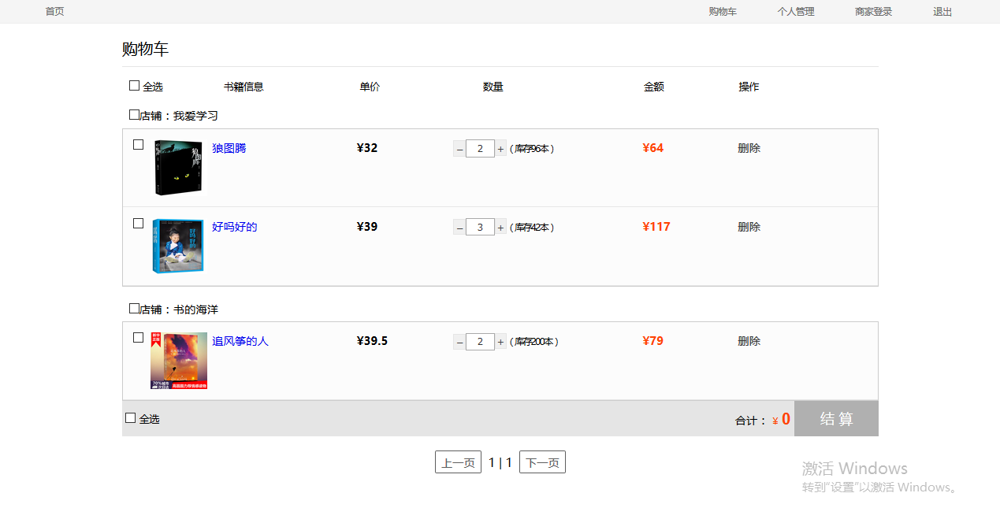
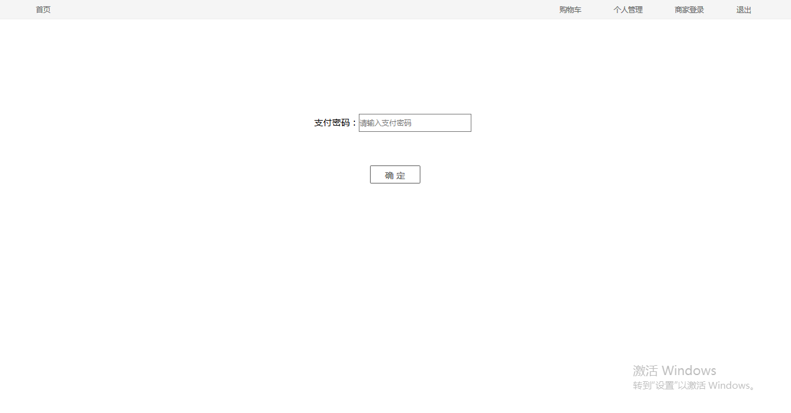

# 基于JSP+Servlet的在线电子书城（商家端+顾客端）

## 运行环境
- Esplise下运行
- Tomcat 6.0
- JDK 7.0
- 使用MySQL数据库，需要先在数据库中创建一个`commercialcity`数据库，利用`source 路径+commercialcity.sql` SQL语句导入数据。
- 在C盘跟目录创建`commercialcity`文件夹，在里面放入图片文件。由于图片文件较大，提供百度云下载地址:http://pan.baidu.com/s/1jHEufXG
- 需要在Eclipse中配置虚拟路径 
Path:/CommercialCity/commercialcity
DocumentBase:C:\commercialcity，在该文件夹中放置程序所需的图片文件

- 同时需要修改src源码包下c3p0-config.xml中数据库连接的密码
- 使用谷歌浏览器
## 开始
顾客端：在Eclipse运行`CustomerMarket.jsp`页面
商家端：在Eclipse运行`ShopperLogin.jsp`页面
顾客账号（对应数据库中`customer`表）：
- 账号：`987654321`, `987654321`
- 账号：`987654322`,密码`987654322`
- 账号：`987654323`,密码`987654323`

商家账号（对应数据库中的`shopper`表，逃）：

- 账号：`123456789`,密码`123456789`
- 账号：`123456788`,密码`123456788`
- 账号：`123456787`,密码`123456787`

## 功能
1. 首页
书籍分类和搜索框跳转至商品浏览页面，搜索框支持部分字搜索，轮播图、猜你喜欢栏、排行榜、新书上架栏跳转至对应商品详细页面

2. 商品浏览
搜索框搜索指定书籍，支持部分字搜索，筛选栏可对书籍类别、排序方式、价格区间进行筛选，点击图片或书名跳转至对应商品详细页面

3. 商品详细页面
搜索框搜索指定书籍跳转至商品浏览页面，支持部分字搜索。用户可浏览商品详细信息，包括介绍、价格、参数、展示图片、介绍图片、书籍评论等，在选定购买数量后可做立即购买或加入购物车操作

4. 用户登录

5. 用户注册

6. 个人信息管理

7. 订单管理

8. 浏览历史

9. 购物车

10. 订单确认

11. 支付

这里只介绍了顾客端的功能，如果需要查看系统的具体可能，可以去查看[使用手册](./docs/使用手册.doc)或者[需求规格说明](./docs/需求规格说明.doc)

## 文档
在项目的doc目录中：
- [需求规格说明](./docs/需求规格说明.doc)
- [详细计说明书](./docs/详细计说明书.doc)
- [数据库文档](./docs/数据库文档.docx)
- [数据库设计](./docs/数据库设计.doc)
- [使用手册](./docs/使用手册.doc)
- [单元测试报告](./docs/单元测试报告.doc)
